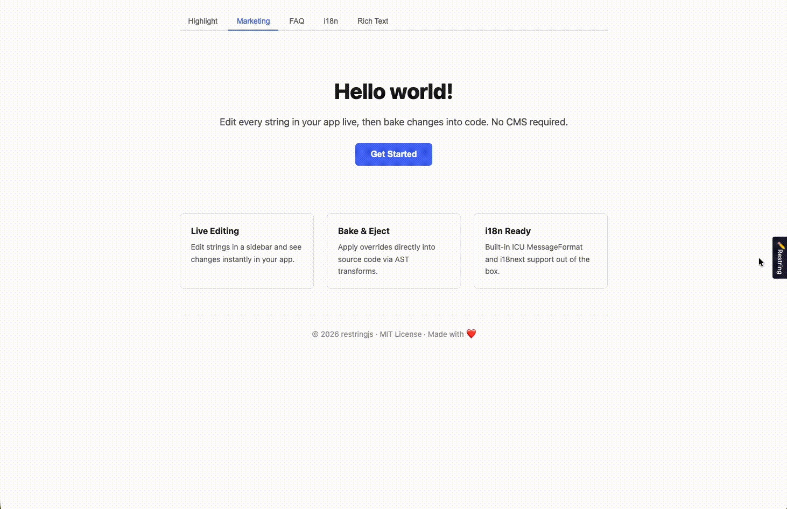
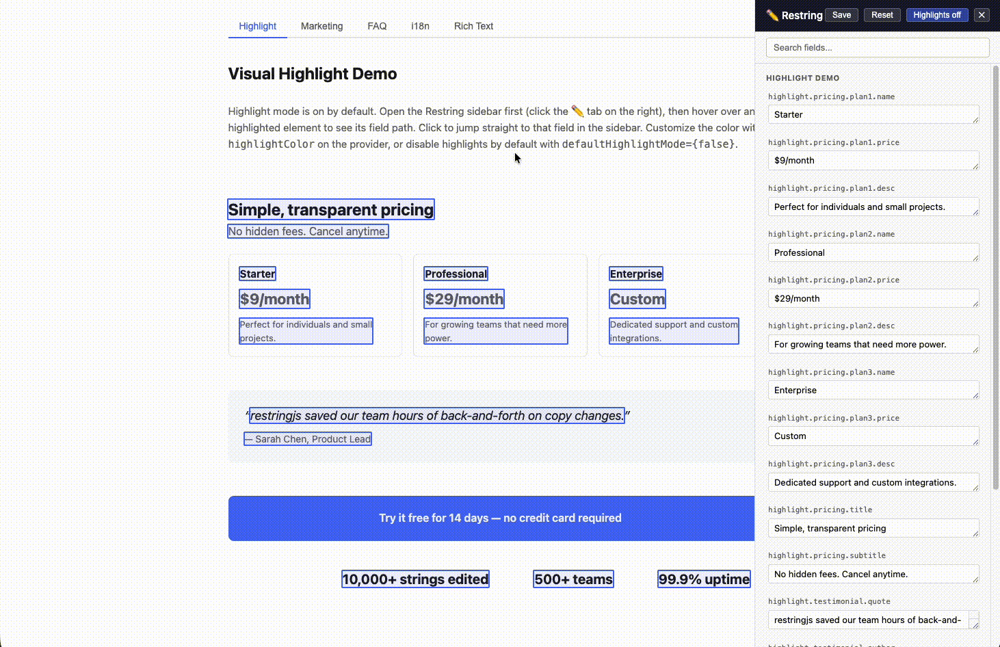
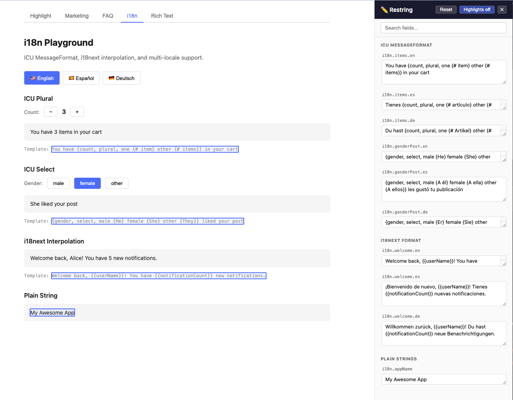

<div align="center">

# restringjs

**Live string editor for React. Edit text in-context, then bake changes into code.**

[](https://www.npmjs.com/package/restringjs)
[](https://bundlephobia.com/package/restringjs)
[](https://github.com/maki-q/restringjs/actions/workflows/ci.yml)
[](https://opensource.org/licenses/MIT)
[](https://www.typescriptlang.org/)
[](https://github.com/maki-q/restringjs/pulls)

<p align="center">
  
</p>

</div>

**restringjs** gives your team a sidebar where they can tweak every user-facing string in your app, see changes instantly, then permanently bake those edits into your source files with a single CLI command. No CMS. No runtime overhead in production.

## Why

You have a marketing team that wants to change "Get Started" to "Start Free Trial." Today that's a Jira ticket, a PR, a deploy. With restringjs, they open the sidebar, make the edit, and a developer runs `npx restringjs bake` to commit it. Or you skip the middleman entirely and bake it yourself.

The key insight: most string changes don't need a CMS. They need a good workflow for getting text changes into source code.

## Features

- **Live editing sidebar** with search, filtering, and section grouping
- **Zero bytes in production** - the sidebar tree-shakes completely when disabled
- **Bake & eject** - AST transforms apply overrides directly into source files, preserving formatting, comments, and quote style. Handles nested objects, arrays, and `as const`
- **Full CLI toolkit** - `bake`, `diff`, `validate`, `export`, `import`, `clear` with `--prefix` support for bridging DB key formats
- **ICU MessageFormat** - syntax validation, variable chips, plural grouping with locale-aware labels
- **i18next support** - auto-detects `{{variable}}` and `$t()` patterns
- **Visual highlight mode** - overlay registered DOM elements, click to jump to the editor
- **RTL-aware** - inputs auto-detect text direction
- **Rich text** - opt-in HTML/Markdown preservation per field
- **Pluggable storage** - memory, localStorage, and REST adapters included (or write your own)
- **Server-side rendering** - Next.js App Router and Pages Router helpers
- **TypeScript-first** - full types, no `any` leakage

## Demo

<p align="center">
  
</p>

See all features in action without setting up a project:

```bash
git clone https://github.com/maki-q/restringjs.git
cd restringjs
pnpm install
pnpm demo
```

Five pages covering basic usage, FAQ sections, i18n (ICU + i18next), rich text editing, and visual highlight mode.

<!-- TODO: Add GIF of highlight mode - clicking overlay, jumping to field in sidebar -->

## Quick Start

```bash
npm install restringjs
```

### 1. Wrap your app

```tsx
import { RestringProvider, RestringSidebar } from 'restringjs';
import { createLocalStorageAdapter } from 'restringjs/adapters';

const adapter = createLocalStorageAdapter();

function App() {
  return (
    <RestringProvider enabled={process.env.NODE_ENV === 'development'} adapter={adapter}>
      <YourApp />
      <RestringSidebar />
    </RestringProvider>
  );
}
```

### 2. Register strings

```tsx
import { useRestring } from 'restringjs';

function Hero() {
  const title = useRestring({
    path: 'hero.title',
    defaultValue: 'Welcome to our app',
    section: 'marketing',
  });

  const subtitle = useRestring({
    path: 'hero.subtitle',
    defaultValue: 'The best way to manage your strings',
    section: 'marketing',
  });

  return (
    <section>
      <h1>{title}</h1>
      <p>{subtitle}</p>
    </section>
  );
}
```

### 3. Bake changes into code

```bash
npx restringjs bake "src/**/*.tsx"
```

Your source files now contain the edited strings. No runtime overhead. No adapter needed in production.

## Visual Highlight Mode

<!-- TODO: Add GIF showing highlight overlays on a page with click-to-jump -->

Overlay registered DOM elements so you can see exactly which strings are editable:

```tsx
import { RestringProvider, RestringSidebar, RestringHighlight } from 'restringjs';

<RestringProvider enabled adapter={adapter}>
  <YourApp />
  <RestringHighlight />
  <RestringSidebar />
</RestringProvider>
```

Click any highlighted element to jump to its field in the sidebar. Overlays track scroll and resize automatically.

Configure the highlight color via the provider:

```tsx
<RestringProvider
  enabled
  adapter={adapter}
  defaultHighlightMode={true}
  highlightColor="#ff6b6b"
>
```

## ICU MessageFormat

restringjs understands ICU syntax out of the box:

```tsx
const greeting = useRestring({
  path: 'greeting',
  defaultValue: 'Hello {name}, you have {count, plural, one {# message} other {# messages}}',
  format: 'icu',
});
```

The sidebar shows variable chips, validates syntax in real time, and groups plural forms with locale-aware labels.

<p align="center">
  
</p>

## i18next Support

```tsx
const welcome = useRestring({
  path: 'welcome',
  defaultValue: 'Welcome {{userName}}! See $t(features.title) for details.',
  format: 'i18next',
});
```

Format detection is automatic. You can omit `format` and let restringjs figure it out.

## Sections

Group related fields in the sidebar:

```tsx
import { useRegisterSection, useRestring } from 'restringjs';

function PricingPage() {
  useRegisterSection({
    id: 'pricing',
    label: 'Pricing Page',
    order: 2,
    description: 'All pricing-related copy',
  });

  const headline = useRestring({
    path: 'pricing.headline',
    defaultValue: 'Simple, transparent pricing',
    section: 'pricing',
  });

  return <h1>{headline}</h1>;
}
```

## Adapters

```ts
import {
  createMemoryAdapter,
  createLocalStorageAdapter,
  createRestAdapter,
} from 'restringjs/adapters';

// Ephemeral (lost on refresh)
const memory = createMemoryAdapter();

// Persists in browser localStorage
const local = createLocalStorageAdapter('my-app:overrides');

// Persists to your API
const rest = createRestAdapter('https://api.example.com/overrides', {
  headers: { Authorization: 'Bearer ...' },
});
```

### Custom adapter

Implement three async methods:

```ts
import type { RestringAdapter } from 'restringjs';

const myAdapter: RestringAdapter = {
  async load() {
    // Return Record<string, string> of field path -> override value
    const res = await fetch('/api/overrides');
    return res.json();
  },
  async save(overrides) {
    await fetch('/api/overrides', {
      method: 'PUT',
      body: JSON.stringify(overrides),
    });
  },
  async clear() {
    await fetch('/api/overrides', { method: 'DELETE' });
  },
};
```

## Server-Side Rendering

### Next.js App Router

```ts
import { createServerApply } from 'restringjs/server';

const apply = createServerApply(async () => {
  // Load overrides from your database, cookie, API, etc.
  return { 'hero.title': 'Server-rendered override' };
});

export default async function Page() {
  const strings = await apply({
    hero: { title: 'Default title', subtitle: 'Default subtitle' },
  });

  return <h1>{strings.hero.title}</h1>;
}
```

### Next.js Pages Router

```ts
import { withRestringOverrides, serverApply } from 'restringjs/server';

export const getServerSideProps = async () => {
  const { restringOverrides } = await withRestringOverrides(() => loadOverrides())();
  const strings = serverApply(defaultStrings, restringOverrides);
  return { props: { strings } };
};
```

## CLI

Every command supports `--help` for full usage details.

### `bake` - Write overrides into source files

AST transform via ts-morph. Preserves formatting, comments, quote style, and code structure. Handles nested objects, arrays, `as const`, and deeply nested paths.

```bash
# Bake overrides into source files
npx restringjs bake "src/**/*.tsx"

# Dry run - preview what would change without writing
npx restringjs bake "src/**/*.tsx" --dry-run

# Custom overrides file (default: .restringjs-overrides.json)
npx restringjs bake "src/**/*.tsx" --overrides=my-overrides.json

# Bridge DB key format to source variable names
# If your DB stores "home.title" but source has `const strings = { home: { title: "..." } }`:
npx restringjs bake "src/**/*.ts" --prefix=strings
```

Bake reports unmatched override keys to stderr so you know if any overrides didn't find a matching path in source.

### `diff` - Compare source strings against overrides

```bash
npx restringjs diff "src/**/*.ts" --overrides=overrides.json
npx restringjs diff "src/**/*.ts" --overrides=overrides.json --prefix=strings
```

Prints a colored table showing path, original value, and override value for each changed field.

### `validate` - Check for stale or empty overrides

```bash
npx restringjs validate "src/**/*.ts" --overrides=overrides.json
npx restringjs validate "src/**/*.ts" --overrides=overrides.json --prefix=strings
```

Flags stale keys (overrides referencing paths that no longer exist in source) and empty values. Exits with code 1 if any issues found - useful in CI.

### `export` - Extract all strings from source

```bash
# Print to stdout
npx restringjs export "src/**/*.ts"

# Write to file
npx restringjs export "src/**/*.ts" --output=strings.json

# Strip variable prefix from keys
npx restringjs export "src/**/*.ts" --prefix=strings
```

Walks source files and extracts every string literal with its dot-path. Use this to bootstrap an overrides file or audit what's editable.

### `import` - Merge overrides into a file

```bash
npx restringjs import --overrides=new-overrides.json
npx restringjs import --overrides=new-overrides.json --target=.restringjs-overrides.json
```

Reads a JSON override map and merges it into the target file (default `.restringjs-overrides.json`).

### `clear` - Reset override file

```bash
npx restringjs clear
npx restringjs clear --target=.restringjs-overrides.json
```

Writes `{}` to the target file.

### The `--prefix` flag

Many apps store override keys without the source variable name (e.g. `home.title` in the database) while the AST resolver produces paths that include it (e.g. `strings.home.title`). The `--prefix` flag bridges this gap across all commands that work with both source files and overrides (`bake`, `diff`, `validate`, `export`).

## API Reference

### Hooks

| Hook | Description |
|------|-------------|
| `useRestring(config)` | Register a field, return its current value (override or default) |
| `useRegister(config)` | Register a field, return `[value, setValue]` tuple |
| `useRegisterSection(config)` | Register a sidebar section for grouping |
| `useFieldValue(path)` | Read a field's current value without registering it |
| `useSnapshot()` | Get the full store snapshot (fields, sections, overrides, dirty state) |

### Components

| Component | Description |
|-----------|-------------|
| `RestringProvider` | Context provider. Set `enabled` to control sidebar availability. |
| `RestringSidebar` | The editing sidebar UI. Search, filter, edit, save. |
| `RestringHighlight` | Visual overlay mode. Renders borders on registered DOM elements. |

### Provider Props

| Prop | Type | Default | Description |
|------|------|---------|-------------|
| `enabled` | `boolean` | required | Whether editing mode is active |
| `adapter` | `RestringAdapter` | memory | Storage adapter for persisting overrides |
| `defaultHighlightMode` | `boolean` | `true` | Whether highlight overlays start enabled |
| `highlightColor` | `string` | `'#4a6cf7'` | CSS color for highlight overlays and accents |

### Utilities

| Function | Description |
|----------|-------------|
| `applyOverrides(obj, overrides)` | Apply overrides to an object immutably |
| `flattenObject(obj)` | Flatten nested object to dot-path keys |
| `unflattenObject(flat)` | Reverse of flatten |
| `detectFormat(value)` | Auto-detect string format (icu, i18next, plain) |
| `createStore(options?)` | Create a standalone store instance |

### Server Exports (`restringjs/server`)

| Function | Description |
|----------|-------------|
| `serverApply(strings, overrides)` | Apply overrides server-side, returns new object |
| `createServerApply(loader)` | Create a reusable apply function with an async override loader |
| `withRestringOverrides(loader)` | Pages Router helper for getServerSideProps |

### Field Config

```ts
interface FieldConfig {
  path: string;          // Dot-path key, e.g. "hero.title"
  defaultValue: string;  // Value before any overrides
  section?: string;      // Group in sidebar
  format?: 'icu' | 'i18next' | 'plain';
  richText?: boolean;    // Enable HTML/Markdown editing
  description?: string;  // Shown in sidebar
  locale?: string;       // e.g. 'en', 'fr'
}
```

## How It Works

1. **Register** strings with `useRestring()`. Each gets a unique dot-path key.
2. **Edit** in the sidebar. Changes are stored via your chosen adapter (localStorage, REST, etc.).
3. **Bake** with the CLI. ts-morph rewrites your source files, replacing default values with overrides.
4. **Eject** if you want. Remove restringjs entirely and your strings are just hardcoded values. No lock-in.

The bake step uses AST transforms (not regex), so it preserves your formatting, comments, and code structure.

## Configuration

Optional config file for CLI defaults:

```ts
// restringjs.config.ts
import { defineConfig } from 'restringjs/config';

export default defineConfig({
  sources: ['src/**/*.{ts,tsx}'],
  locale: 'en',
  format: 'icu',
  adapter: {
    type: 'rest',
    endpoint: 'https://api.example.com/overrides',
  },
});
```

## Requirements

- React 18+ (uses `useSyncExternalStore`)
- TypeScript 5+ recommended
- Node.js 18+ for CLI

## Roadmap to 1.0

The following are planned before a stable 1.0 release:

- **Template literal support in bake** - Currently, backtick strings (`` `Hello ${name}` ``) are gracefully skipped. Plain backtick strings without interpolation (`NoSubstitutionTemplateLiteral`) should be replaceable.
- **Full ICU MessageFormat validation** - Current validation is brace-matching only. A proper AST parse would catch malformed plural/select syntax before save.
- **import/clear for non-file adapters** - `import` and `clear` CLI commands only support file-based targets today. localStorage and REST adapter support is planned.
- **CHANGELOG** - Proper release-by-release changelog (started in CHANGELOG.md, will be fleshed out with each release).

If any of these are blocking your use case, [open an issue](https://github.com/maki-q/restringjs/issues).

## Contributing

```bash
git clone https://github.com/maki-q/restringjs.git
cd restringjs
pnpm install
pnpm check    # typecheck + lint
pnpm test     # run tests
pnpm demo     # start demo app
```

## License

[MIT](./LICENSE) - [Quinton Maki](https://qmaki.dev)

---

<div align="center">

If you find this useful, consider [buying me a coffee](https://buymeacoffee.com/qmaki) :coffee:

[Report a Bug](https://github.com/maki-q/restringjs/issues) - [Request a Feature](https://github.com/maki-q/restringjs/issues) - [Discussions](https://github.com/maki-q/restringjs/discussions)

</div>
